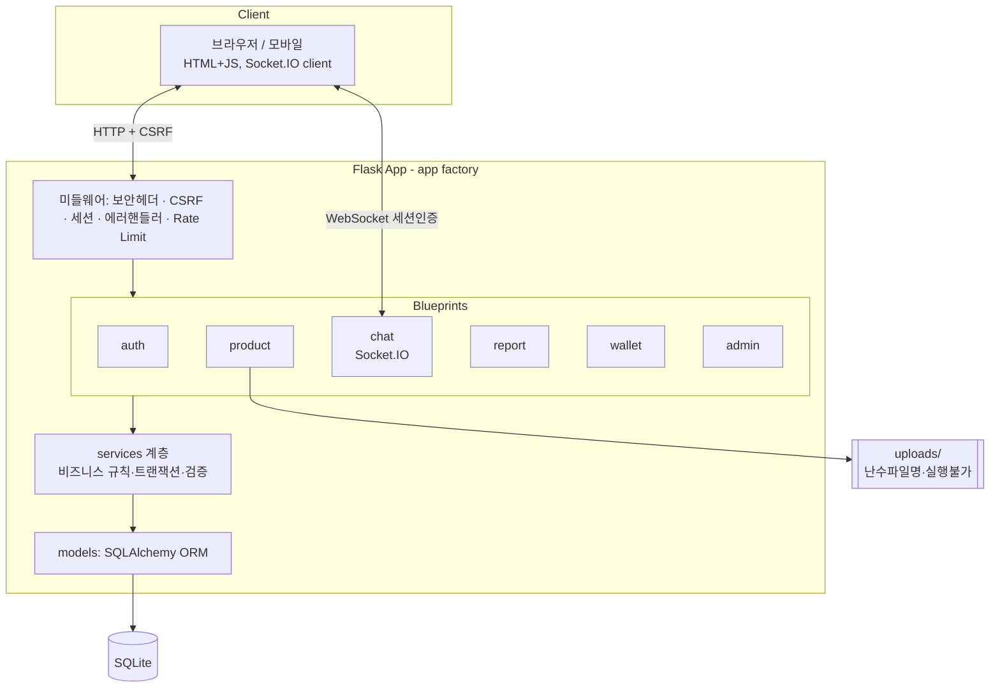
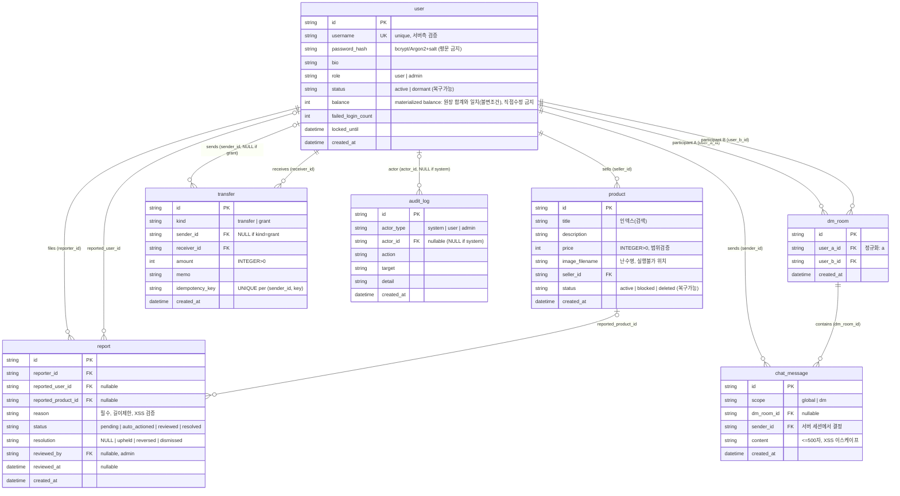
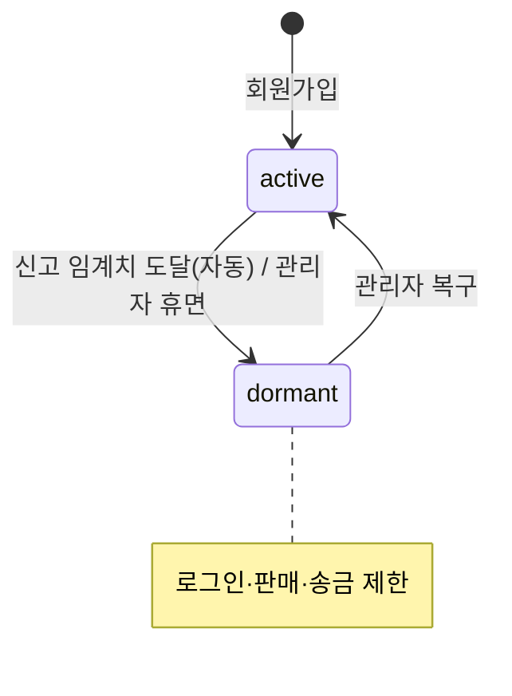
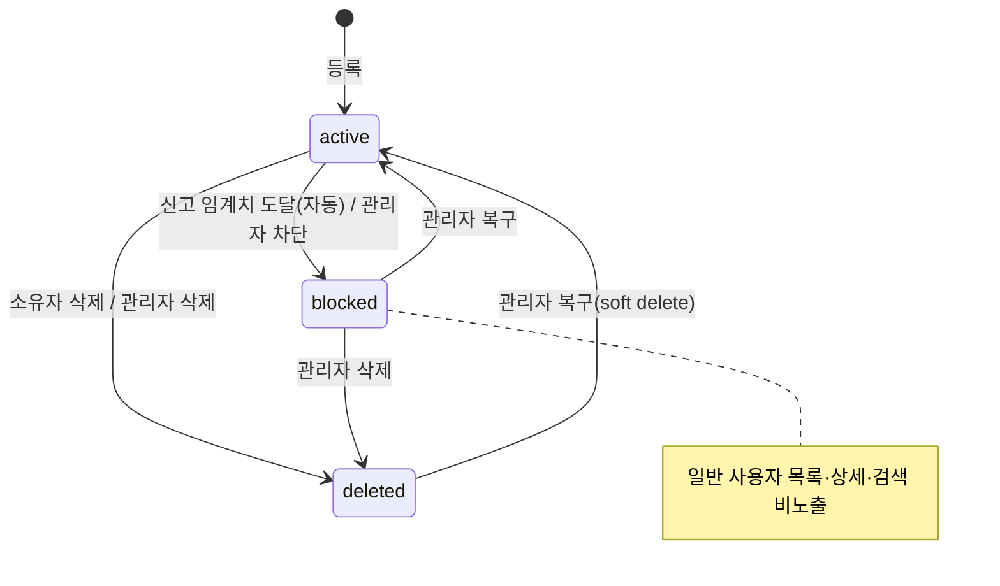
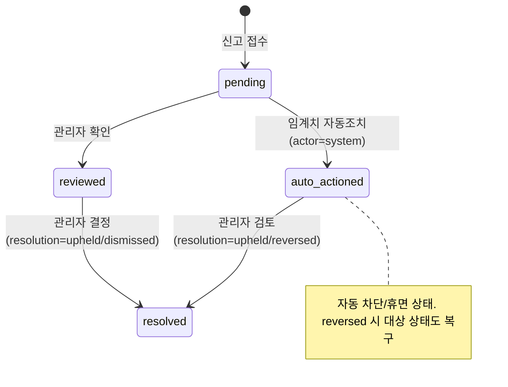
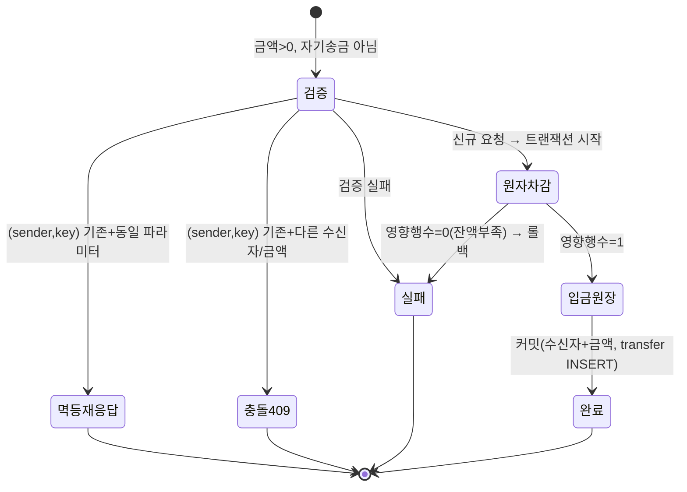

# 시스템 설계 (P1 압축 설계 문서)

> 작성: 2026-07-23, Claude (Fable 5)
> 상위 문서: [`DEVELOPMENT_PLAN.ko.md`](DEVELOPMENT_PLAN.ko.md) · 감사: [`STARTER_SECURITY_AUDIT.ko.md`](STARTER_SECURITY_AUDIT.ko.md) · before 증적: [`BASELINE_RUNTIME_EVIDENCE.ko.md`](BASELINE_RUNTIME_EVIDENCE.ko.md) · baseline: `f0dd4baac057f62315bb4850f05d18b7e60eb4be`
> 목적: 요구사항 R1~R7을 실제 시스템으로 구현하기 위한 단일 설계 기준. 구현(P2~) 전 확정하여 애자일 반복 중 구조 붕괴를 막는다.
> ID 체계: 요구사항 `R1~R7`, 기능 `F<대>.<소>`, 취약점 `V-01~V-18`(감사문서), 공식 체크리스트 `①~㉗`, **프로젝트 보안 요구사항 `SR-xx`**(공식 체크리스트에 없는 항목), 테스트 `T-xxx`.

---

## 1. R1~R7 세부 수용 기준 (Acceptance Criteria)

각 기준은 P9에서 테스트(T-xxx)로 검증한다. "누구나 조회"와 "로그인 필요"의 경계를 명시한다.

### R1 — 회원가입·사용자 관리
- AC1.1 아이디/비밀번호로 가입 가능하며 **아이디 중복 시 거부**(unique). (F1.1, F1.6)
- AC1.2 비밀번호는 **정책(최소 길이 등) 검증** 후 **해시(bcrypt/Argon2+salt)로만 저장**, 평문 저장·로그 금지. (V-02)
- AC1.3 로그인 성공 시 세션 발급, 로그아웃 시 세션 파기. **로그인 5회 실패 시 일정 시간 잠금/지연**. (V-09)
- AC1.4 로그인 사용자는 **다른 사용자 프로필(사용자명·소개글) 조회 가능**. 비밀번호 해시·잔액 등 민감정보는 노출 금지. (F1.3)
- AC1.5 마이페이지에서 **소개글 수정** 가능. (F1.4)
- AC1.6 마이페이지에서 **비밀번호 변경** 가능하되 **현재 비밀번호 재확인(재인증)** 필요. (F1.5, ⑤)
- AC1.7 모든 폼은 **CSRF 토큰**, 모든 입력은 **서버측 검증**(길이·허용문자·형식). (①②)

### R2 — 상품 등록·조회·관리
- AC2.1 **비로그인 사용자도** 상품 **목록·상세 조회 가능**(active 상품만). (F2.2, F2.3, §5 접근제어)
- AC2.2 상품 등록은 **로그인 필요**. 제목·가격·설명·**사진** 저장. 가격은 **정수·범위 검증**. (F2.1, ⑧)
- AC2.3 사진 업로드는 **확장자·MIME·크기(≤5MB) 검증 + 난수 파일명 + 실행 불가 위치** 저장. (V-18)
- AC2.4 **본인 상품만 수정·삭제** 가능(소유자 검증, IDOR 방지). (F2.4, ⑪)
- AC2.5 목록은 이름 위주 표시, 클릭 시 상세. 목록은 **20개/페이지 페이지네이션**.
- AC2.6 **차단·삭제된 상품, 휴면 유저의 상품은 일반 사용자에게 비노출**(관리자만 열람). (§5)

### R3 — 사용자 소통(채팅)
- AC3.1 로그인 사용자는 **전체 실시간 채팅** 참여 가능. (F3.1)
- AC3.2 두 사용자 간 **1:1 DM** 가능하며, **해당 방 참여자만** 읽기/쓰기. (F3.2, §7 권한)
- AC3.3 발신자 신원은 **서버 세션에서 결정**(클라이언트가 보낸 username 신뢰 금지). (V-05)
- AC3.4 메시지 **길이(≤500자)·내용 서버측 검증 + XSS 이스케이프**, **사용자별 Rate Limiting**. (⑬⑮⑯)
- AC3.5 Socket 연결 시 **인증 확인**, 미인증 연결·발화 차단, 허용 Origin 제한. (⑭)

### R4 — 악성 유저·상품 차단(신고)
- AC4.1 로그인 사용자는 **사용자 또는 상품을 신고**하며 **사유 필수**. (F4.1, ⑲)
- AC4.2 **자기 신고 금지, 대상별 사용자당 1회**(중복 차단). (㉑)
- AC4.3 **서로 다른 유효 사용자**의 신고가 **임계치**(예: 3) 도달 시 **상품 자동 차단(blocked)**. (F4.2)
- AC4.4 임계치 도달 시 **유저 자동 휴면(dormant)** — 휴면 유저는 로그인·판매·거래 제한. (F4.3)
- AC4.5 임계치 집계는 **active 사용자 신고만** 포함. 자동 조치된 신고는 이후 **관리자가 검토하여 유지(upheld) 또는 기각·복구(reversed)** 할 수 있고, 모든 조치는 **감사 로그**에 남는다(자동 조치 포함). (㉑, SR-04, §6 상태전이)

### R5 — 사용자 간 송금
- AC5.1 송금은 **실화폐가 아닌 플랫폼 포인트**(과제용)로 정의. 초기/관리자 지급은 balance 직접 수정이 아니라 **`transfer.kind='grant'`(sender 없음) 원장**으로 발생 → 모든 잔액 변화가 추적 가능(무한잔액 시스템계정 불필요). (F5.1, SR-03, §5, 요구사항 변경 §10)
- AC5.2 **양의 정수 금액**, **잔액 이내**, **자기 송금 금지**. (SR-03)
- AC5.3 송금은 **원자적 조건부 차감 + 영향행수 1 검증 + 입금 + 불변 원장 기록**을 단일 트랜잭션으로. (V-14, §6)
- AC5.4 **idempotency key**로 동일 요청 재전송·병렬 송금 중복 방지. 규칙: `(sender_id, idempotency_key)` UNIQUE, 키는 예측 불가 UUID. **같은 키+같은 수신자/금액 → 기존 성공 결과 재응답(멱등)**, **같은 키+다른 수신자/금액 → 409 Conflict**. (T-503)
- AC5.5 사용자는 **본인 거래 내역** 조회 가능. (F5.3)

### R6 — 상품 검색
- AC6.1 **비로그인 포함 누구나** 제목/설명 키워드로 **검색** 가능, active 상품만. (F6.1)
- AC6.2 검색은 **파라미터 바인딩**, 정렬 필드는 **허용목록 제한**(SQLi 방지). (㉒)
- AC6.3 성능 기준은 데이터 규모를 명시: **시드 상품 1,000개 기준 로컬 2초 이내** 응답, 결과 20개/페이지.

### R7 — 관리자 전체 관리
- AC7.1 `role=admin`만 관리자 라우트 접근. (F7.1, §5)
- AC7.2 사용자 관리: **휴면 전환/복구**. (F7.2)
- AC7.3 상품 관리: **차단/삭제/복구**. (F7.3)
- AC7.4 신고 검토: `pending→reviewed`, 조치 시 `resolution ∈ {upheld, reversed, dismissed}` 기록(자동조치 건도 검토·복구 가능). (F7.4, §6)
- AC7.5 거래·**감사 로그 열람**. 단 **비밀번호 해시 등 민감정보 열람 금지**, **잔액 직접 수정 불가**(오직 `transfer` 원장 통해서만). (F7.5, §6)

---

## 2. 추적표 (요구사항 → 기능 ID → 취약점(V-xx) → 체크리스트/SR → 테스트 ID)

> 체크리스트 번호는 **공식 CSV 정의에 해당하는 경우에만** 표기한다. 억지 재사용 대신 해당 없으면 `—`로 두고, 공식 항목에 없는 보안 요구는 프로젝트 `SR-xx`로 연결한다(아래 정의).

| Req | 기능 ID | 기능 | 관련 V-xx(개선) | 체크리스트/SR | 테스트 ID |
|-----|---------|------|-----------------|---------------|-----------|
| R1 | F1.1 | 회원가입 | V-02,V-06 | ①②③, SR-01 | T-101 가입/중복거부, T-102 약한비번거부 |
| R1 | F1.2 | 로그인/로그아웃 | V-01,V-02,V-09,V-11 | ③④⑤⑥ | T-103 로그인, T-104 5회실패잠금 |
| R1 | F1.3 | 사용자 조회 | V-10 | SR-02 | T-105 타인프로필열람/민감정보비노출 |
| R1 | F1.4 | 소개글 수정 | V-03,V-06,V-15 | ①② | T-106 XSS입력이스케이프 |
| R1 | F1.5 | 비밀번호 변경 | V-11 | ⑤ | T-107 현재비번재인증 |
| R1 | F1.6 | 아이디 중복 방지 | V-06 | SR-01 | T-101 |
| R2 | F2.1 | 상품 등록(+사진) | V-06,V-18 | ⑧⑨⑩⑫ | T-201 가격검증, T-202 업로드검증, T-207 상품XSS방어, T-208 비로그인등록거부 |
| R2 | F2.2 | 상품 목록(공개) | V-10 | SR-02 | T-203 비로그인목록조회 |
| R2 | F2.3 | 상품 상세(공개) | V-10 | SR-02 | T-204 비로그인상세, T-205 차단상품비노출 |
| R2 | F2.4 | 내 상품 수정·삭제 | V-10 | ⑩⑪ | T-206 타인상품수정거부(IDOR) |
| R3 | F3.1 | 전체 채팅 | V-05,V-07 | ⑬⑭⑮⑯ | T-301 발신자위조차단, T-302 rate limit |
| R3 | F3.2 | 1:1 DM | V-05 | ⑭, SR-02 | T-303 비참여자DM접근거부 |
| R4 | F4.1 | 신고 접수 | V-08 | ⑱⑲⑳ | T-401 사유필수, T-402 자기/중복신고차단 |
| R4 | F4.2 | 상품 자동 차단 | V-08 | ㉑, SR-04 | T-403 임계치→차단 |
| R4 | F4.3 | 유저 자동 휴면 | V-08 | ㉑, SR-04 | T-404 임계치→휴면 |
| R5 | F5.1 | 포인트 잔액/지급 | V-14 | SR-03 | T-501 시드지급(grant)원장기록 |
| R5 | F5.2 | 송금 | V-14 | SR-03 | T-502 음수/초과/자기송금거부, T-503 병렬·재전송중복방지/409 |
| R5 | F5.3 | 거래 내역 | V-10 | SR-02 | T-504 본인내역만 |
| R6 | F6.1 | 상품 검색 | V-13 | ㉒ | T-601 검색, T-602 정렬필드주입차단 |
| R7 | F7.1 | 관리자 대시보드/RBAC | V-10 | SR-02 | T-701 비관리자접근거부 |
| R7 | F7.2 | 사용자 휴면/복구 | V-08 | SR-04 | T-702 복구 |
| R7 | F7.3 | 상품 차단/삭제/복구 | V-08 | SR-04 | T-703 복구 |
| R7 | F7.4 | 신고 검토 | V-08 | ⑳, SR-04 | T-704 상태·resolution 전이 |
| R7 | F7.5 | 거래·감사 로그 열람 | V-16 | ⑳㉖, SR-05 | T-705 민감정보비노출/잔액직접수정불가 |
| 전체 | — | 공통 기반 | V-01,V-03,V-04,V-12,V-16,V-17 | ②④⑤⑦㉔㉕㉖㉗ | T-901~908(§11 부록) |

### 프로젝트 보안 요구사항 (SR — 공식 체크리스트에 없는 항목)

- **SR-01 사용자명 유일성**: `username` UNIQUE + 가입 시 중복·경쟁조건 없이 거부.
- **SR-02 접근제어 정책**: 익명 공개조회 경계(§5), 로그인 요구, **관리자 RBAC 및 라우트 분리**, 상품 소유자·DM 참여자·본인 데이터(IDOR) 검증.
- **SR-03 송금 트랜잭션 무결성**: 양의 정수·잔액 이내·자기송금 금지·원자적 조건부 차감·(sender,idempotency_key) 멱등·불변 원장·grant 지급 모델.
- **SR-04 신고 자동조치 거버넌스**: active 사용자 신고만 집계·임계치 자동 조치·관리자 검토(upheld/reversed/dismissed)·복구·감사 로그.
- **SR-05 시스템/자동 행위 감사**: 자동 조치·시스템 지급을 audit_log(`actor_type=system`)로 추적, 부인 방지.

---

## 3. 시스템 아키텍처



- **계층 분리**: Blueprint(라우팅/입력) → service(규칙·트랜잭션·권한) → model(ORM). 라우트는 얇게, 보안 규칙은 service에 모아 테스트 가능하게.
- **공통 미들웨어**: 앱 팩토리에서 보안 헤더(㉔), CSRFProtect(②), 세션 설정(④⑤), 전역 에러 핸들러(⑦㉖)를 일괄 등록.
- **Rate Limiting은 2계층으로 분리**(⑥⑯): **HTTP 라우트는 Flask-Limiter**(로그인·송금 등), **Socket.IO 이벤트는 별도 사용자 ID 기반 카운터/토큰 버킷**(Flask-Limiter가 Socket 이벤트를 자동 보호하지 않음). 로그인 제한은 **계정 단위 잠금 + IP 단위 rate limit + 점진적 지연**을 함께 적용(단순 5회 계정잠금은 타인 계정 잠금 DoS가 될 수 있음).
- **환경 분리**: `Config`(dev/test/prod). 로컬 HTTP `SESSION_COOKIE_SECURE=False`, HTTPS(ngrok/운영) `True`.

---

## 4. 페이지 맵 (라우트 · 인증 요구)

| 경로 | 메서드 | 화면/기능 | 인증 | 비고 |
|------|--------|-----------|------|------|
| `/` | GET | 랜딩/공개 상품 목록 진입 | 익명 | |
| `/products` | GET | 상품 목록(공개, 페이지네이션) | **익명 가능** | active만 |
| `/products/search` | GET | 상품 검색 | **익명 가능** | active만 |
| `/products/<id>` | GET | 상품 상세(공개) | **익명 가능** | 차단/삭제 비노출 |
| `/register` | GET/POST | 회원가입 | 익명 | CSRF |
| `/login` | GET/POST | 로그인 | 익명 | 실패 잠금 |
| `/logout` | POST | 로그아웃 | 로그인 | CSRF |
| `/me` | GET/POST | 마이페이지(소개글) | 로그인 | |
| `/me/password` | POST | 비밀번호 변경 | 로그인 | 재인증 |
| `/me/products` | GET | 내 상품 관리 | 로그인 | 소유자 |
| `/products/new` | GET/POST | 상품 등록(+사진) | 로그인 | 업로드 검증 |
| `/products/<id>/edit` | GET/POST | 상품 수정 | 로그인+소유자 | IDOR 방지 |
| `/products/<id>/delete` | POST | 상품 삭제 | 로그인+소유자 | CSRF |
| `/users/<id>` | GET | 사용자 프로필 조회 | 로그인 | 민감정보 제외 |
| `/chat` | GET | 전체 채팅 | 로그인 | Socket |
| `/chat/dm/<user_id>` | GET | 1:1 DM | 로그인+참여자 | Socket room |
| `/report` | GET/POST | 신고 접수 | 로그인 | 사유필수·중복차단 |
| `/wallet` | GET | 잔액·거래내역 | 로그인 | 본인만 |
| `/wallet/transfer` | POST | 송금 | 로그인 | 원자적·idem |
| `/admin` | GET | 관리자 대시보드 | admin | |
| `/admin/users` `/admin/products` `/admin/reports` `/admin/logs` | GET | 목록 조회 | admin | 감사로그 |
| `/admin/users/<id>/dormant` `/admin/users/<id>/restore` | POST | 사용자 휴면/복구 | admin | CSRF·감사 |
| `/admin/users/<id>/grant` | POST | 플랫폼 포인트 지급(grant 원장) | admin | CSRF·멱등·감사 |
| `/admin/products/<id>/block` `/admin/products/<id>/restore` `/admin/products/<id>/delete` | POST | 상품 차단/복구/삭제 | admin | CSRF·감사 |
| `/admin/reports/<id>/review` `/admin/reports/<id>/resolve` | POST | 신고 검토/결정(upheld·reversed·dismissed) | admin | CSRF·감사 |

> 상태 변경은 조회(GET)와 분리한 **개별 POST 엔드포인트**로 설계하여 CSRF·권한 테스트 경계를 명확히 한다.

Socket.IO 이벤트: `connect`(세션 인증), `global_message`, `join_dm`(참여자 검증), `dm_message`, `disconnect`. 모든 이벤트에서 발신자=서버 세션, **사용자 ID 기반 이벤트 Rate Limit**(§3, HTTP Flask-Limiter와 별개) 적용.

---

## 5. ERD



### ERD 제약조건 (mermaid로 표현 불가한 규칙 — DB CHECK/UNIQUE로 강제)

1. **신고 대상 FK 2개 + "정확히 하나만 존재"**
   `CHECK ((reported_user_id IS NOT NULL) <> (reported_product_id IS NOT NULL))` — 사용자 신고 XOR 상품 신고. FK로 대상 존재를 DB가 보장(다형성 target_id 폐기).
2. **대상별 중복 신고 UNIQUE**
   `UNIQUE(reporter_id, reported_user_id)`, `UNIQUE(reporter_id, reported_product_id)` — 한 사용자가 같은 대상을 1회만 신고. + 애플리케이션에서 **자기 신고 금지**(reporter_id ≠ reported_user_id) 및 상품 자기신고(판매자=신고자) 차단.
3. **송금 종류(transfer/grant) + 멱등 UNIQUE**
   `transfer.kind ∈ {transfer, grant}`. 일반 송금은 `sender_id` 필수, 지급은 `sender_id=NULL, kind=grant`(무한잔액 시스템계정 불필요).
   ```sql
   CHECK ((kind='transfer' AND sender_id IS NOT NULL AND sender_id <> receiver_id)
       OR (kind='grant'    AND sender_id IS NULL))
   CHECK (amount > 0)
   UNIQUE (sender_id, idempotency_key)   -- 전역 UNIQUE보다 발신자별 UNIQUE
   ```
   멱등 규칙: 같은 `(sender,key)`+같은 수신자/금액 → 기존 성공 결과 재응답, 다른 수신자/금액 → 409 Conflict. 키는 예측 불가 UUID.
4. **조건부 잔액 차감 + 불변 원장 + materialized balance**
   잔액 변경은 서비스에서 단일 트랜잭션: ①`UPDATE user SET balance = balance - :amt WHERE id=:sender AND balance >= :amt` ②영향행수=1일 때만 수신자 `+:amt` ③`transfer` 원장 INSERT. `transfer`는 **append-only(수정·삭제 없음)**. `user.balance`는 **원장에서 감사 가능한 materialized balance**(성능용 캐시)로, 원장 합계와 항상 일치하는 불변조건을 유지.
5. **관리자도 잔액 직접 수정 불가**
   admin 라우트/서비스는 `user.balance` 직접 UPDATE 경로를 제공하지 않음. 관리자 지급조차 `transfer(kind='grant')` 원장으로만 발생 → 모든 잔액 변화가 추적 가능.
6. **DM 참여자 권한 구조**
   `dm_room(user_a_id, user_b_id)`로 참여자를 명시. `UNIQUE(user_a_id, user_b_id)` + **`CHECK(user_a_id < user_b_id)`**(정규화, 방향 중복 방지) + **자기 자신 DM 금지**(a≠b는 a<b로 자동 보장). `chat_message.scope='dm'`이면 `dm_room_id` 필수(`CHECK((scope='global' AND dm_room_id IS NULL) OR (scope='dm' AND dm_room_id IS NOT NULL))`). Socket `join_dm`/`dm_message`는 **세션 사용자가 해당 room의 a 또는 b인지 검증**한 뒤에만 허용.
7. **상품·사용자 차단/휴면 복구 가능 상태(soft delete)**
   `product.status ∈ {active, blocked, deleted}`, `user.status ∈ {active, dormant}`. 삭제는 **soft delete**로 자동/관리자 조치(blocked/dormant/deleted) 모두 관리자에 의해 active로 **복구 가능**(§6). 상태 변경은 `audit_log`에 기록.
8. **감사 actor(자동/시스템 행위 표현)**
   `audit_log.actor_id`는 **nullable**, `actor_type ∈ {system, user, admin}`.
   `CHECK((actor_type='system' AND actor_id IS NULL) OR (actor_type IN ('user','admin') AND actor_id IS NOT NULL))`.
   신고 임계치 자동 차단·시스템 지급 등 행위자 없는 조치는 `actor_type='system'`(actor_id NULL)으로 기록하고, `actor_type='admin'`은 서비스에서 실제 관리자 역할을 확인 → 부인 방지(SR-05).
9. **신고 상태·결정 조합**
   `status IN ('pending','auto_actioned','reviewed','resolved')`, `resolution IS NULL`은 미결 상태에만 허용하고 `status='resolved'`이면 `resolution IN ('upheld','reversed','dismissed')` 및 `reviewed_by/reviewed_at`을 필수로 한다. `auto_actioned` 건의 `dismissed`는 대상 복구를 뜻하는 `reversed`로 기록해 상태 의미를 하나로 유지한다.

---

## 6. 상태 전이

### 사용자 status


### 상품 status (soft delete — 모두 복구 가능)


### 신고 status + resolution (자동조치 후 검토·복구 가능)

> `status`(진행)와 `resolution`(결정: upheld/reversed/dismissed)을 분리해, 임계치로 즉시 조치된 건도 이후 관리자가 검토·기각·복구한 이력을 표현(`reviewed_by`/`reviewed_at` 기록).

### 송금(트랜잭션 처리 흐름)

> `transfer` 원장은 불변(완료 후 변경 없음). "실패/409/멱등재응답"은 새 원장 미기록.

---

## 7. 권한표 (일반 사용자 / 소유자 / 관리자)

범례: ✅ 허용 · ❌ 불가 · 👁 조회만 · —(해당없음)

| 작업 | 익명 | 로그인(일반) | 소유자/당사자 | 관리자 |
|------|------|--------------|---------------|--------|
| 상품 목록·상세·검색(active) | ✅ | ✅ | ✅ | ✅(차단/삭제 포함) |
| 차단·삭제 상품 조회 | ❌ | ❌ | ❌ | ✅ |
| 상품 등록 | ❌ | ✅ | — | ✅ |
| 상품 수정·삭제 | ❌ | ❌(타인) | ✅(본인) | ✅ |
| 사용자 프로필 조회(비민감) | ❌ | 👁 | 👁 | 👁 |
| 비밀번호 해시·타인 잔액 조회 | ❌ | ❌ | ❌ | ❌ |
| 소개글·비밀번호 변경 | ❌ | — | ✅(본인) | ❌(타인) |
| 전체 채팅 | ❌ | ✅ | ✅ | ✅ |
| 1:1 DM 읽기/쓰기 | ❌ | ❌(비참여) | ✅(참여자) | ❌ 기본. **신고된 메시지의 증적 스냅샷만** 검토(전체 DM 열람 금지) |
| 신고 접수 | ❌ | ✅(타인/타상품) | ❌(자기신고) | ✅ |
| 송금 | ❌ | ✅(본인→타인) | ✅ | ❌(직접), 지급은 원장 |
| 거래 내역 조회 | ❌ | 👁(본인) | 👁(본인) | 👁(감사) |
| 사용자 휴면/복구 | ❌ | ❌ | ❌ | ✅ |
| 상품 차단/삭제/복구 | ❌ | ❌ | 삭제만(본인) | ✅ |
| 신고 검토·상태변경 | ❌ | ❌ | ❌ | ✅ |
| 잔액 직접 수정 | ❌ | ❌ | ❌ | ❌(불가, 원장만) |
| 감사 로그 열람 | ❌ | ❌ | ❌ | ✅ |

---

## 8. STRIDE 위협 모델과 보안 통제

| STRIDE | 위협 예시 | 관련 V-xx | 통제(체크리스트) |
|--------|----------|-----------|------------------|
| **S**poofing(위장) | 세션 위조(약한 SECRET), 채팅 발신자 사칭, 미인증 접근 | V-01,V-05 | 환경변수 SECRET_KEY, 서버측 세션 인증, 발신자=세션결정, 로그인 요구(④⑭) |
| **T**ampering(변조) | 가격·잔액·타인 상품/신고 조작, 폼 파라미터 변조 | V-06,V-10,V-14 | 서버측 검증, 소유자/권한 검사, 원자적 잔액 차감, ORM 제약(⑧⑪⑫㉒) |
| **R**epudiation(부인) | 관리자 조치·거래 부인 | V-08,V-16 | 불변 원장(transfer), audit_log, 상태전이 기록(⑳) |
| **I**nfo Disclosure(정보노출) | 비밀번호 평문/해시 노출, 스택트레이스, 민감정보 로그 | V-02,V-04,V-16 | 해시 저장, debug=False+에러핸들러, 로그 마스킹, 민감필드 응답 제외(③⑦㉖) |
| **D**oS(서비스거부) | 채팅 플러딩, 로그인 무차별, 대용량 업로드 | V-07,V-09,V-18 | Rate Limiting, 실패 잠금, 업로드 크기/타입 제한(⑥⑯) |
| **E**levation(권한상승) | 일반→관리자, IDOR, 비참여 DM 접근 | V-05,V-10 | role 검사, 소유자/참여자 검증, 관리자 라우트 분리(⑩⑪) |
| 추가: Injection | SQLi, XSS, 파일 업로드 실행 | V-13,V-15,V-18 | 파라미터 바인딩+정렬 허용목록, 출력 이스케이프+입력검증, MIME/확장자/난수명(⑨㉒) |
| 추가: CSRF | 상태변경 요청 위조 | V-03 | 전 폼 CSRF 토큰(②) |
| 추가: 신고 남용 | 집단/중복 신고로 정상 유저 휴면 유도 | V-08 | 자기신고 금지·대상별 1회 UNIQUE·유효사용자 집계·관리자 복구(㉑) |

---

## 9. 측정 가능한 비기능 요구사항 (NFR)

| 항목 | 기준 | 검증 |
|------|------|------|
| 상품 목록/검색 | 20개/페이지 페이지네이션 | T-203/T-601 |
| 검색 응답 | **시드 상품 1,000개 기준** 로컬 2초 이내 | 수동 계측 |
| 이미지 업로드 | ≤5MB, jpg/png/webp | T-202 |
| 채팅 메시지 | ≤500자 | T-302 |
| 신고 사유 | ≤1,000자 | T-401 |
| 로그인 실패 | 5회 실패 시 10분 잠금/지연 | T-104 |
| 채팅 Rate Limit | 5msg/5s(사용자별) | T-302 |
| 비밀번호 | 최소 8자 등 정책 | T-102 |
| 모바일 | 360px 화면에서 주요 기능 사용 | 수동(핸드폰) |
| 보안 헤더 | CSP·X-Frame-Options·X-Content-Type-Options 존재 | T-902 |

> 수치는 구현·테스트하며 조정하고, 변경 시 사유를 보고서에 기록.

---

## 10. 구현 우선순위 & 요구사항 변경 사유

### 구현 우선순위 (수직 기능 단위, DEVELOPMENT_PLAN P2~P11과 일치)
1. **P2 공통 기반**: app factory, ORM 모델·제약, 인증(해시·세션·CSRF·로그인 잠금), 보안 헤더, 에러 핸들러, Config 분리. — 이후 모든 기능의 토대.
2. **P3 R1 유저 관리** → **P4 R2 상품+R6 검색+사진** → **P6 R4 신고·차단·자동조치** → **P8 R7 관리자**(신고·상태 관리의 상위) → **P5 R3 채팅(전체/DM)** → **P7 R5 송금**.
   - 근거: 신고·관리자·상태는 데이터/권한 모델의 중심이므로 채팅·송금보다 먼저 뼈대를 세운다. 채팅·송금은 상대적으로 독립적이라 후반 배치.
3. **P9 27항목 체크리스트 전수 + 침투 테스트** → **P10 README·실사용(핸드폰/ngrok)** → **P11 보고서**.

### P2 구현 주의사항 (설계 반영)
- **DB 마이그레이션**: Flask-Migrate/Alembic 도입(스키마 CHECK·UNIQUE·인덱스를 마이그레이션으로 관리, 재현 가능).
- **이미지 검증 강화**: 확장자·MIME뿐 아니라 **Pillow로 실제 디코딩·재인코딩** + 최대 픽셀 수 제한(위장 파일·이미지 폭탄 방지). 저장은 난수 파일명·실행 불가 위치.
- **로그인 제한**: 계정 단위 잠금 + **IP 단위 rate limit + 점진적 지연** 병행(타인 계정 잠금 DoS 완화).
- **Rate Limiting 분리**: HTTP=Flask-Limiter, Socket=사용자 ID 기반 카운터(§3).
- **신고 임계치**: active 사용자 신고만 집계, 복구 시 관련 감사 로그 필수(SR-04/05).

### 요구사항 변경·구체화 사유 (보고서에 반영)
- **송금 = 실화폐 아님, 플랫폼 포인트**: 결제/PG·실명·정산은 과제 범위·법적 리스크를 넘어섬. 강의도 "스스로 고민"으로 위임(전사문 108행). 포인트 원장 모델로 보안 통제(원자성·idempotency·불변원장)를 명확히 시연.
- **신고 모델 다형성 → FK 2개 + CHECK**: `target_type/target_id`는 DB가 대상 존재를 보장 못 함. FK 분리로 무결성·중복방지(UNIQUE)를 DB 레벨에서 강제.
- **상품 목록/상세를 대시보드(로그인)와 분리**: 슬라이드 25쪽 "누구나 조회" 요구를 스타터 구조(`/dashboard` 로그인 강제)가 위반하므로 공개 라우트를 신설.
- **자동 차단/휴면에 관리자 복구·감사 로그 추가**: 집단 신고 악용 시 정상 유저 피해를 관리자가 되돌릴 수 있어야 함(가용성·부인방지).
- **가격 TEXT → INTEGER, 사진 필드 추가**: 요구사항(가격·사진 표시)과 데이터 무결성 충족.

---

## 11. 부록 — 공식 체크리스트 ①~㉗ 전 항목 검증 매핑

> 27개 항목 각각을 **구현 위치 → 검증 방법 → 테스트/증적 ID**로 연결. 이 표는 P9 점검 및 최종 보고서 체크리스트로 그대로 사용한다.

| # | 항목 | 구현 위치 | 검증 방법 | 테스트/증적 ID |
|---|------|-----------|-----------|----------------|
| ① | 서버측 입력 검증 | auth/product/report validators(service) | 경계·악성 입력 케이스 | T-102,T-201,T-401 |
| ② | CSRF 보호 | app factory CSRFProtect + 폼 토큰 | 토큰 누락 POST 거부 | T-901 |
| ③ | 비밀번호 해시 | auth service(bcrypt/Argon2+salt) | DB에 해시만 저장(평문X) | T-101 + before 증적 대조 |
| ④ | 세션 쿠키 설정 | Config(HttpOnly/SameSite/Secure) | 응답 Set-Cookie 플래그 확인 | T-904 |
| ⑤ | 세션 만료·재인증 | Config lifetime + 비번변경 재인증 | 만료 후 접근·재인증 요구 | T-107,T-904 |
| ⑥ | 실패 로그인 방어 | auth service(계정잠금+IP limit+지연) | 5회 실패 잠금, 타계정 DoS 완화 | T-104 |
| ⑦ | 오류 메시지 | 전역 에러 핸들러 | 500에서 스택트레이스 미노출 | T-903 + before 증적 대조 |
| ⑧ | 폼 입력 검증(가격) | product service | 음수·문자·범위초과 거부 | T-201 |
| ⑨ | XSS 방어 | 출력 이스케이프 + 입력 검증 | 소개글·상품 스크립트 페이로드 무해화 | T-106,T-207 |
| ⑩ | 인증된 사용자만 등록 | product 라우트 @login_required | 비로그인 상품 등록·변경 차단 | T-208 |
| ⑪ | 소유자 확인 | product service 소유자 검사 | 타인 상품 수정·삭제 거부 | T-206 |
| ⑫ | 데이터 무결성 | ORM 제약(NOT NULL/타입/CHECK) | 잘못된 형식 저장 거부 | T-201 |
| ⑬ | 메시지 내용 검증 | chat service(길이·이스케이프) | 500자 초과·스크립트 거부 | T-302 |
| ⑭ | 사용자 인증(Socket) | connect 세션 인증 | 미인증 연결·발화 차단 | T-301 |
| ⑮ | 메시지 검증(서버측) | chat service | 위조 필드·형식 검증 | T-301 |
| ⑯ | Rate Limiting | Socket 사용자ID 카운터 | 플러딩 제한 | T-302 |
| ⑰ | 연결 암호화(WSS) | 운영 HTTPS/WSS(ngrok) | wss:// 접속 확인 | T-905(증적) |
| ⑱ | 신고 폼 입력 검증 | report service | target·reason 검증 | T-401 |
| ⑲ | 인증된 사용자 접근(신고) | report 라우트 @login_required | 비로그인 신고 차단 | T-401 |
| ⑳ | 데이터 무결성·로그(신고) | report service + audit_log | 접수·조치 감사 기록 | T-704 |
| ㉑ | 신고 남용 방지 | UNIQUE + service(자기/중복/임계치) | 자기·중복 신고 거부 | T-402 |
| ㉒ | ORM·파라미터 바인딩 | 전 쿼리 ORM + 정렬 허용목록 | 정렬 필드 주입 차단 | T-602 |
| ㉓ | DB 최소 권한 | SQLite·업로드 경로 OS 권한 최소화 | 비인가 OS 사용자 읽기·쓰기 차단 확인(SQLite는 DB 계정 미지원) | T-906(증적) |
| ㉔ | 보안 헤더 | after_request 헤더 | CSP/XFO/XCTO 존재 | T-902 |
| ㉕ | HTTPS 적용 | 운영 HTTPS(ngrok) | https 접속 확인 | T-905(증적) |
| ㉖ | 에러·예외 처리 | 전역 핸들러 + 로그 마스킹 | 민감정보 없는 오류·로그 | T-908 |
| ㉗ | 의존성 관리 | 버전 고정 + pip-audit | 취약 의존성 점검 결과 | T-907(증적) |

> 신규 테스트/증적 ID: **T-904** 쿠키 플래그·세션 만료·재인증, **T-905** HTTPS/WSS·Origin, **T-906** DB·업로드 폴더 권한, **T-907** pip-audit·버전 고정, **T-908** 민감정보 없는 오류·로그.

---

### 다음 단계
P2 착수 전 이 문서를 기준선으로 확정. 구현 중 설계 변경이 생기면 본 문서를 갱신하고 사유를 남긴다. (테스트 ID는 P9에서 실제 테스트와 1:1 연결)
